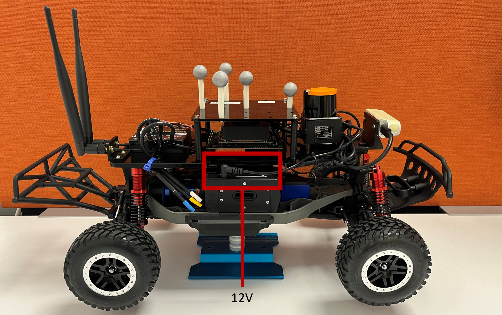
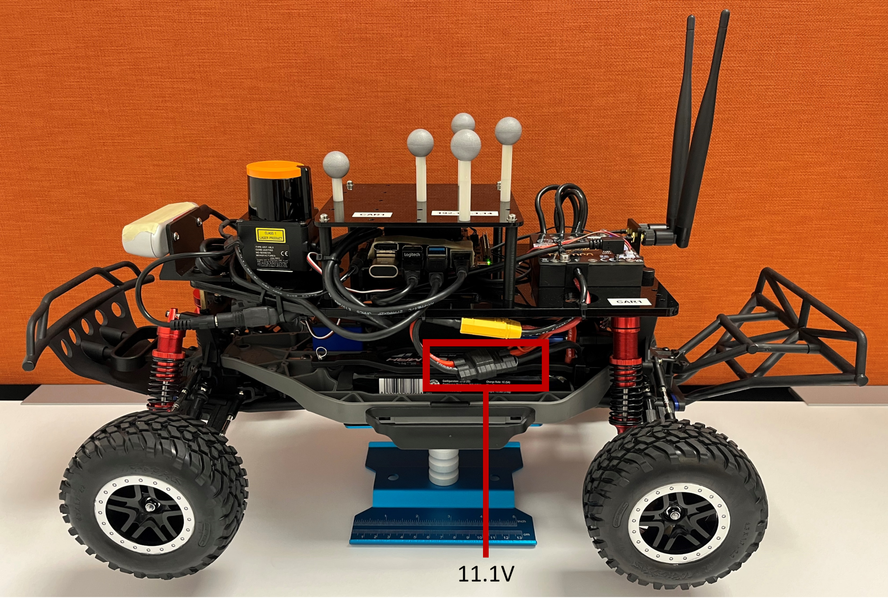
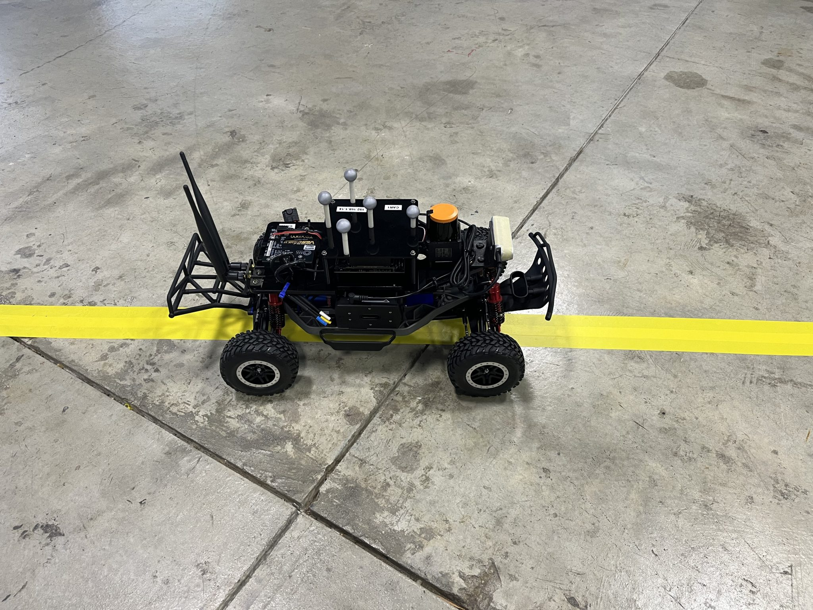
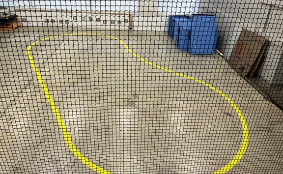
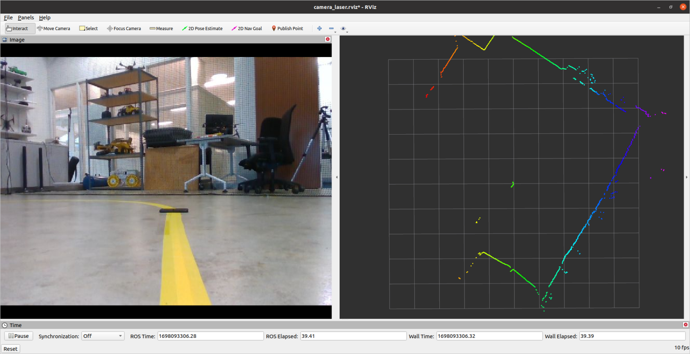

## Mount Batteries
  1. Connect the 12V battery for NVIDIA Jetson Orin and LiDAR sensor.



    2. Connect the 11.1V Lipo battery for F1TENTH car and VESC



    3. The NVIDIA Jetson computer will boot automatically. Put the F1TENTH car on the ground and go to Host Computer Setup

 





## PC Setup
 1. Connect your personal laptop to lab’s route.  
    Wifi Name: ViconRouter5G  or ViconRouter2.4G  
    Wifi Password: ViconRouter

 2. Use [VNC viewer](https://developer.nvidia.com/embedded/learn/tutorials/vnc-setup) software to connect NVIDIA Jetson computer remotely.  
    Open RealVNC Viewer, choose File -> New connection
 VNC viewer is also available on the Vicon System

 3. Alternatively use ssh (preferred)
 ```
 ssh -X orin@192.168.1.101
 
 # if you don't need GUI you can disable X11 forwarding

 ssh orin@192.168.1.101
 ```
 4. If you have ubuntu24 or can run it on a docker container or have ros2 for Windows. You can subscribe to ros2 topics on your PC. You can run visualization by running this (image stream will still be slow).  
 Make sure your ROS_DOMAIN_ID is the same as the car.
 > [!NOTE] See the [f1tenth_simulator]() repo for ubuntu22 docker image.
 ```
 # On the car, check DOMAIN ID
 echo $ROS_DOMAIN_ID
 # or 
 printenv | grep ROS

 # On remote PC
 export ROS_DOMAIN_ID=51
 # check topics if nodes are up and running on car
 ros2 topic list
 ros2 launch f1tenth_control visualization_launch.py
 ```
 


## To Launch pure pursuit demo
```
cd your_ws
source install/setup.bash
ros2 launch f1tenth_control pure_pursuit.launch.py car_name:=car#
```
